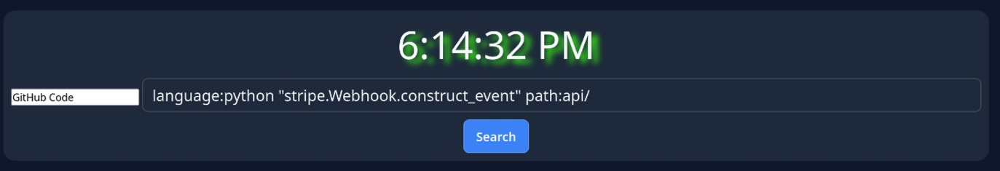

# TN Search

[](https://github.com/tyleruploads/tn-search/blob/main/LICENSE)
[](https://github.com/tyleruploads/tn-search/issues)

[TN Search](https://github.com/tyleruploads/tn-search) is a New Tab Page offering over 50 search engines and tools for various workflows, built for developers, by a developer.



## Live Demos

Try it out, right now!

- [tn-search.pages.dev/](https://tn-search.pages.dev/)
- [search.tyler.is-a.dev/](https://search.tyler.is-a.dev/)
- [tn-search.dino.icu/](https://tn-search.dino.icu/)
- [search.tyler.dino.icu/](https://search.tyler.dino.icu/)

## Features
- **50+ Search Engines and Tools:** Categories of search engines and tools include The Classics, Privacy, AI, Code, Academic & Research, Encyclopedia, Packages, Documentation, Containers & DevOps, Domains & Networking, and Cybersecurity.
- **Developer First**: Built for developers who want one page where everything they need is right in front of them.
- **Search**: Search through all of the search engines and tools, no need to find them yourself.
- **Privacy & Security**: No tracking, telemetry, ads, accounts, or any other sneaky data collection.

See [search-providers.md](search-providers.md) to view a full list of categorized search engines and tools.

## The Stack

- HTML5
- CSS3
- JavaScript
- ZERO Frameworks

## How to Use

The only two things to remember:
- Use the keyboard combination `Ctrl + /` to highlight the input box
- Nothing else!

### How to Set as Your Default New Tab Page

Since TN Search is hosted as a website, you can easily set it as your browser's new tab page with an extension! Make sure to configure the New Tab Page setting in the extension you download, and point it to TN Search's website.

* **Chrome / Brave:** [Custom New Tab](https://chromewebstore.google.com/detail/custom-new-tab/lfjnnkckddkopjfgmbcpdiolnmfobflj)
* **Firefox:** [New Tab Override](https://addons.mozilla.org/en-US/firefox/addon/new-tab-override/)
* **Edge:** [Custom New Tab](https://microsoftedge.microsoft.com/addons/detail/custom-new-tab/onagfgjlokaciajhjmajljcfanonbmia)

## Running Locally

Absolutely ZERO setup required! Simply clone the repository and open `index.html` right in your browser!

```bash
git clone https://github.com/tyleruploads/tn-search.git
cd tn-search

# Open index.html in your browser, or run a local server
python3 -m http.server 8000
```

## Contributing

Contributions are what make open-source projects important. All contributions are highly appreciated

* **Found a bug or issue**: Open an Issue and show the output of the script, the steps to reproduce it, and as much information as possible
* **Have an idea**: Open an Issue and explain your idea as much as possible, why you think it would be a good addition to the project, and any other important information.

## Security

For information on reporting security vulnerabilities in TN Search, see [SECURITY.md](SECURITY.md).

## License

This project is licensed under the MIT License - see the [LICENSE](LICENSE) file for more information.
